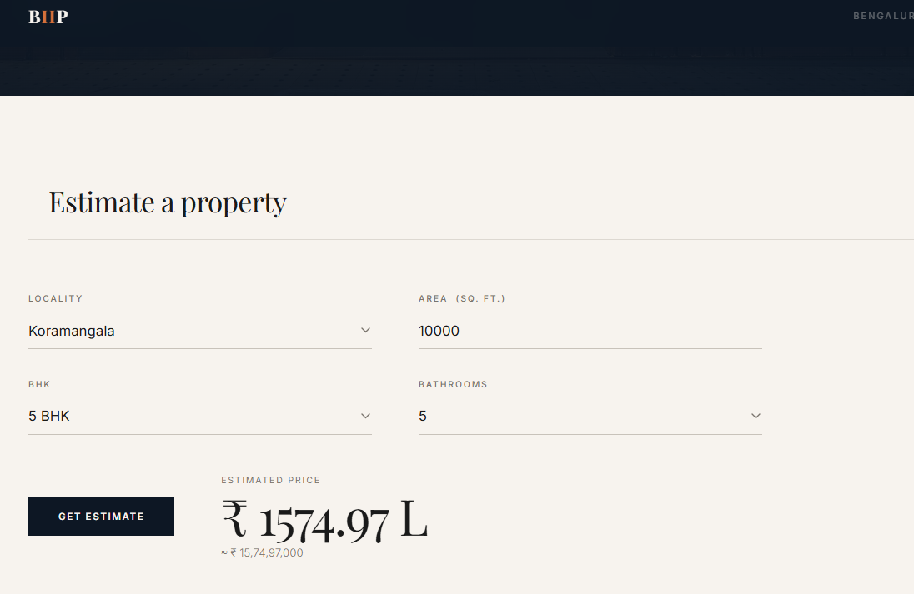

# BHP — Bengaluru House Price Predictor

A full-stack machine learning application that predicts residential property prices across 240 localities in Bengaluru. Trained on 7,000+ real transactions, served through a Flask REST API, and presented through a custom web frontend.

---

## Preview




---

## Project Structure

```
BHP/
├── README.md
├── requirements.txt
│
├── data/                               # Raw and processed datasets
│   ├── Bengaluru_House_Data.csv        # Original dataset (13,320 records)
│   └── bhp.csv                         # Intermediate cleaned dataset
│
├── model/                              # Model training
│   ├── RealEstatePrediction.ipynb      # Original exploratory notebook
│   └── train_model.py                  # Improved training script (run this)
│
├── server/                             # Flask backend
│   ├── server.py                       # API routes
│   ├── util.py                         # Model loading and inference
│   └── artifacts/                      # Trained model files (auto-generated)
│       ├── banglore_home_prices_model.pickle
│       ├── columns.json
│       └── model_meta.json
│
└── client/                             # Web frontend
    ├── index.html                      # Landing page (open directly in browser)
    └── _DSC9610-Edited_-min.jpg        # Hero image
```

---

## Setup

**Requirements:** Python 3.10+

```bash
pip install -r requirements.txt
```

---

## How to Run

### 1. Download the dataset (only needed if you want to retrain)

Download `Bengaluru_House_Data.csv` from [Kaggle](https://www.kaggle.com/datasets/amitabhajoy/bengaluru-house-price-data) and place it in `data/`.

### 2. Train the model (optional — artifacts are already included)

```bash
cd model
py -3.10 train_model.py
```

Trains and benchmarks LinearRegression, Ridge, RandomForest, and GradientBoosting with cross-validation. Saves the best model to `server/artifacts/`.

### 2. Start the server

```bash
cd server
py -3.10 server.py
```

Server starts at `http://127.0.0.1:5000`

### 3. Open the frontend

Open `client/index.html` directly in any browser. No build step needed.

---

## API Endpoints

### `GET /get_location_names`
Returns all supported Bengaluru localities.

```json
{
  "locations": ["indira nagar", "whitefield", "koramangala", "..."]
}
```

### `POST /predict_home_price`
Predicts the price of a property in Lakh INR.

**Request body (JSON):**
```json
{
  "location":    "indira nagar",
  "total_sqft":  1200,
  "bhk":         3,
  "bath":        2
}
```

**Response:**
```json
{
  "estimated_price": 143.27
}
```

---

## Model

| | Value |
|---|---|
| Algorithm | Gradient Boosting Regressor |
| Target | `log(price)` → inverted on output |
| CV R² | 0.8547 |
| Test R² | 0.9007 |
| Training samples | 7,286 |
| Features | 6 (sqft, bath, BHK, location encoding, sqft/BHK, bath/BHK) |

**Location encoding:** Each locality is encoded as its smoothed mean price (target encoding), collapsing 240 one-hot columns into a single dense feature. This lets the tree model learn location effects efficiently.

### Data pipeline

1. Drop irrelevant columns (`area_type`, `society`, `balcony`, `availability`)
2. Parse BHK count from the `size` column
3. Convert sqft ranges (e.g. `1200–1500`) to midpoint averages
4. Collapse locations with ≤10 listings into `other`
5. Remove properties where `sqft / BHK < 300` (unrealistic density)
6. Remove price-per-sqft outliers beyond ±1 std within each locality
7. Remove BHK outliers where a larger BHK is cheaper per sqft than a smaller one
8. Remove properties where `bath > BHK + 2`

---

## Tech Stack

- **ML:** scikit-learn (GradientBoostingRegressor), pandas, numpy
- **Backend:** Flask
- **Frontend:** Vanilla HTML/CSS/JS — no framework, no build step
- **Fonts:** Playfair Display + Inter (Google Fonts)
